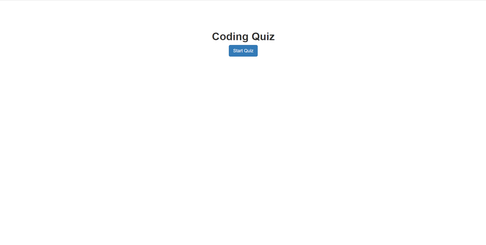
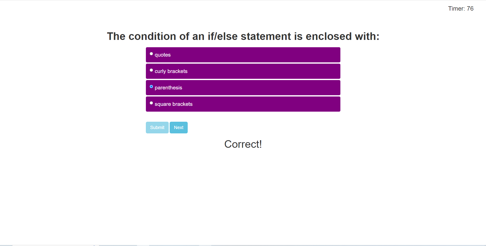
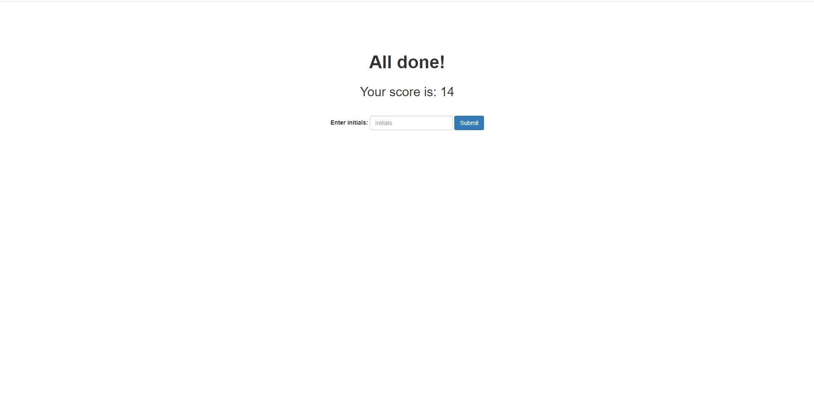
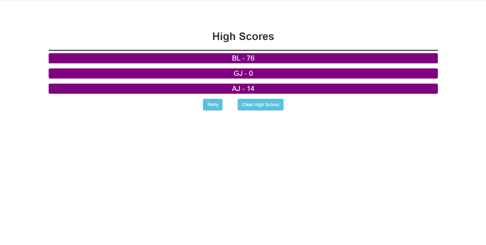

# 04 Web APIs: Code Quiz

## Description
A simple coding quiz game that test's a user's knowledge on basic programming concepts. A project utilizing various web APIs as well as a couple third party APIs to create a simple, clean quiz game. Uses various concepts from the week's unit such as using localStorage to save user high scores, setInterval to create a game timer, and Event Listeners to handle click events and add interaction to the game.

## Usage
The quiz game can be accessed [here](https://brian-lascuna.github.io/coding-quiz/).

Upon loading the webpage, you are greeted with a plain page with a "Start Quiz" button. Clicking "Start Quiz" will bring a timer into view (top-right corner) and start the timer. The user will have 100 seconds to answer 5 different programming questions. Answering correctly will proceed the quiz as normal while answering incorrectly will deduct 20 seconds from the timer. When the user answers all 5 questions or the timer hits 0, the game is over and the user will be brought to the end screen. A score is given based on the remaining time the user had and the user can type in their initials and save their score which will be saved in the browser's local storage. Submitting their score will bring the user to the score page where they can view their score alongside any other existing scores. The scores will persist upon subsequent visits unless the user clicks the "Clear High Scores" button which will clear the local storage. Clicking "Retry" will reset the quiz game back to the beginning.

## Credits
N/A

## License
N/A
